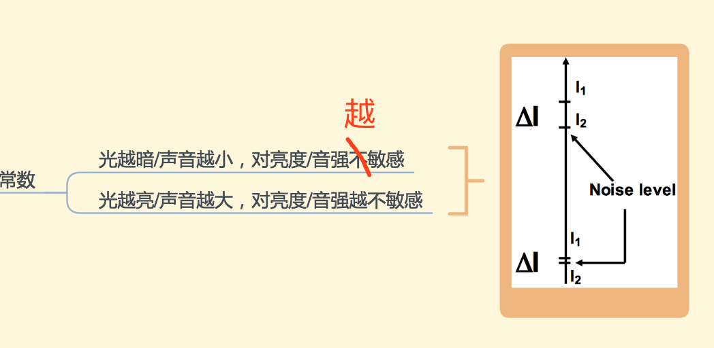

# Year4 Lecture Notes
考前积点人品，把我这学期的笔记放到G上来吧，这样更新也更方便厚... 
emmm个人复习进度慢得骚虱子所以各位见谅哈 
资料有什么问题可以微信私戳我惹，比如很可能资料里的条目没有显示全啥的。。。 
另外关于思维导图，如果觉得看pdf不方便的话可以试一下下个XMind（选Zen版），就可以打开.xmind文件啦～ 
就酱，然后我把每次更新的内容写在这下面吧 

-----
## 01.18 Update
多媒体系统Week3,4思维导图上传。
昨天Xmind更新了，测试版结束了，现在导出pdf有watermark了🙃 
很有意思。刚看完watermark... 
 
**16:37 update**
 sorry三四周里有一个小错误噢！⬇️⬇️

## 01.16 Update
多媒体系统Week1,2思维导图done。

## 01.15 Update
图处L7-11思维导图done。

## 01.13 Update
图处L1-6的思维导图上传（L7-11可能会慢点因为我想先看看多媒体系统以及写写毕设...）
多媒体系统课件笔记上传。
